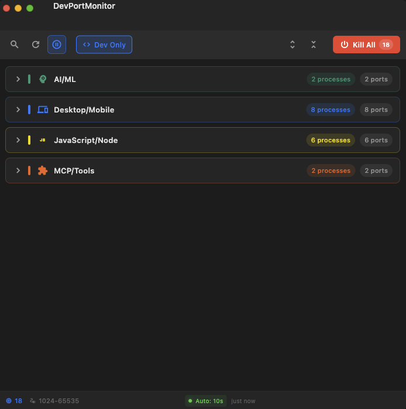
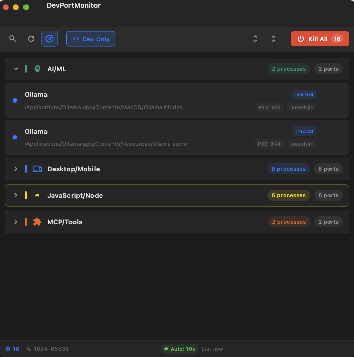

<div align="center">

# DevPortMonitor

**A local dev port monitor for macOS and Windows**

DevPortMonitor quickly scans localhost dev servers (ports 3000–9000),
shows **which stacks are using which ports** at a glance, and lets you
**terminate them instantly** when needed.

<p>
  
  
  
  
</p>

</div>

---

## ✨ Highlights

- **Auto‑detects** localhost dev servers (ports 3000–9000)
- **Smart grouping** by tech stack (Node, Python, Ruby, Java, etc.)
- **One‑click kill** for single processes or all dev ports
- **Auto refresh** every 10 seconds
- **Clean, macOS‑like UI** with search & filters

## 🖼 Preview

<p align="center">
  
  
</p>

## 🧱 Tech Stack

- Flutter 3.0+
- Riverpod
- MVVM Architecture
- Targets: macOS, Windows

## 📦 Getting Started

### Requirements

- Flutter SDK 3.0+
- macOS: Xcode 14+ (Command Line Tools)
- Windows: Visual Studio 2022 (C++ build tools)

### Install

```bash
flutter pub get
```

### Run

**macOS**
```bash
flutter run -d macos
```

**Windows**
```bash
flutter run -d windows
```

### Build

**macOS**
```bash
flutter build macos --release
```

**Windows**
```bash
flutter build windows --release
```

## 🗂 Project Layout

```
lib/
├── core/
├── data/
└── presentation/
```

## 🔍 What It Detects

- JavaScript/Node: Node.js, npm, yarn, pnpm, Deno, Bun, Next, Nuxt, Remix
- Python: Python, Uvicorn, Gunicorn, Flask, Django, FastAPI
- Ruby: Ruby, Rails, Puma, Unicorn
- Java/JVM: Java, Gradle, Maven, Spring, Tomcat
- Go: Go, Gin, Fiber
- Rust: Cargo
- .NET: dotnet, Kestrel
- Databases/Infra: Docker, Redis, MongoDB, PostgreSQL, MySQL, Nginx, Apache

## 🔐 Permissions

This app lists local processes and can terminate them. On macOS, it uses system tooling to read port usage and send kill signals. It only manages processes owned by the current user by default.

## 🧩 Contributing

PRs are welcome. Keep changes focused and consistent with the existing architecture.

## 📄 License

MIT. See [LICENSE](LICENSE).
